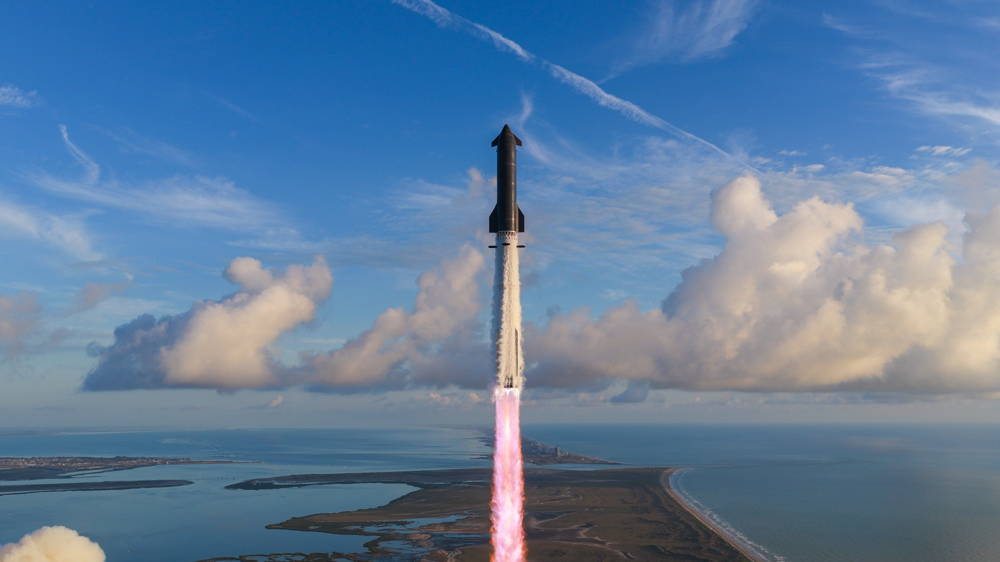
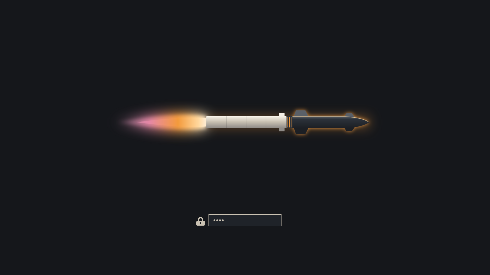

# Starship

An [Omarchy](https://omarchy.org) theme built from photos of SpaceX's latest Starship launch.



## Install

```bash
omarchy theme install https://github.com/zachwilke/omarchy-starship-theme
```

## Palette

| Role | Color | From |
|---|---|---|
| Background | `#15171b` | Starship's black heat-shield tiles |
| Accent | `#f39a3c` | Raptor engine flame at liftoff |
| Foreground | `#cac2b3` | Sunlit exhaust clouds |
| Blue / Cyan | `#5b93d1` / `#6fa8c4` | Gulf sky and water |
| Magenta | `#d79ac0` | The pink Raptor plume |
| Green | `#9fb07a` | Boca Chica marsh grass |
| Yellow / Brown | `#dda237` / `#966d53` | Golden-hour light and tidal flats |

Terminal, Hyprland, btop, Neovim and other app configs are generated by Omarchy from `colors.toml`.

## Backgrounds

1. **Ascent** – Ship and booster climbing over the coastline
2. **Liftoff** – Aerial view of the launch mount at ignition
3. **Tower** – Clearing the tower
4. **Golden Hour** – Silhouette at sunset, reflected in the water

## Unlock screen

`unlock.png` is a glowing Starship silhouette for the disk-unlock boot screen (source in `unlock.svg`). Pick it from **Style → Unlock** in the Omarchy menu.



## Credits

Launch photography © SpaceX, used here as desktop wallpapers. This is a fan theme and is not affiliated with or endorsed by SpaceX.
